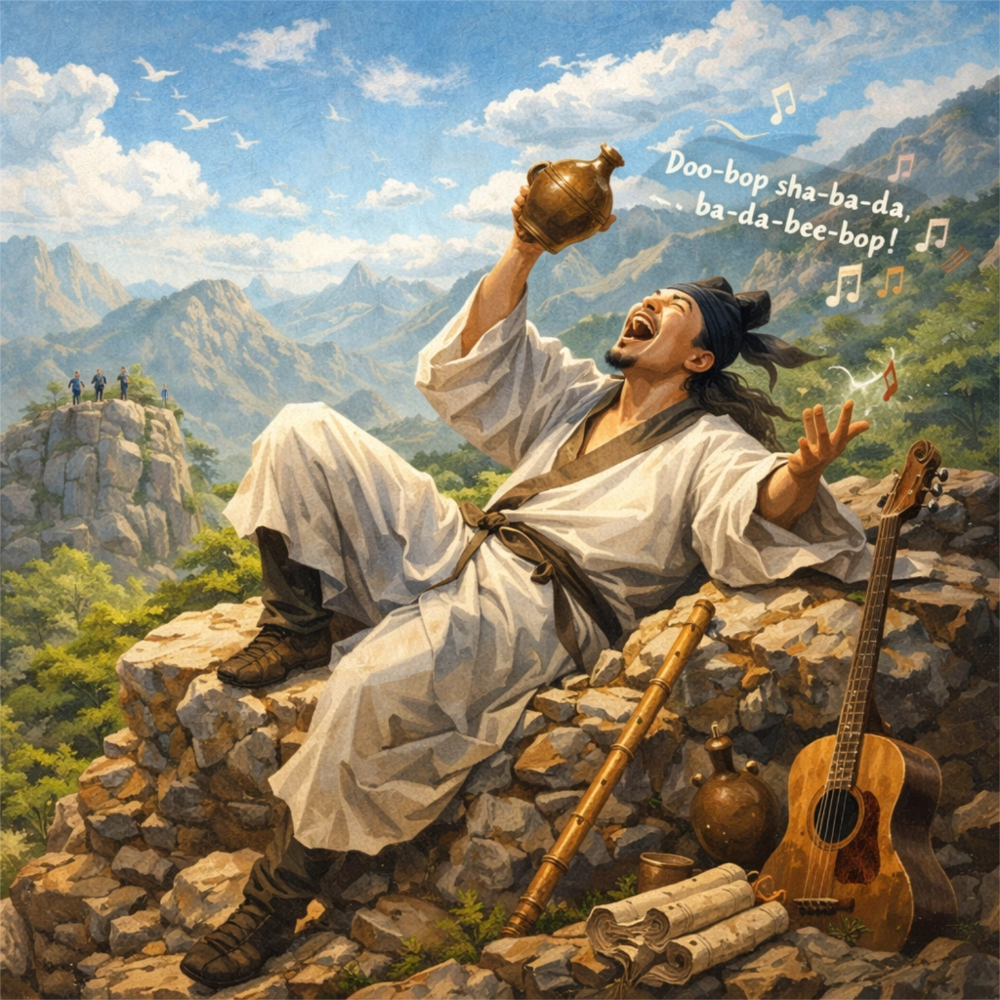

# 醉中走上黄茅冈 · 云龙醉吟 Scat

  

## Lyrics

醉中走上黄茅冈  
满冈乱石如群羊  
冈头醉倒石作床  
仰看白云天茫茫  
歌声落谷秋风长  
路人举首东南望  
拍手大笑使君狂  

醉中走上黄茅冈  
满冈乱石如群羊  
冈头醉倒石作床  
仰看白云天茫茫  
歌声落谷秋风长  
路人举首东南望  
拍手大笑使君狂  

歌声落谷秋风狂  

歌声落谷秋风狂  

拍手大笑使君狂  