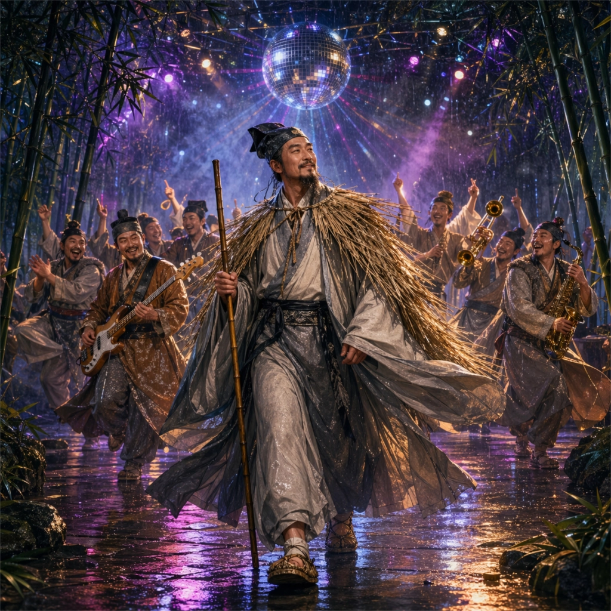

# 定风波 · 烟雨舞平生 Disco

  

## Lyrics

D-I-N-G F-E-N-G B-O  
We sing our way through the Ding Feng Bo  
D-I-N-G F-E-N-G B-O  
Let the rain make you stronger  
Everyone is singing Ding Feng Bo  

莫听穿林打叶声  
何妨吟啸且徐行  
竹杖芒鞋轻胜马  
谁怕  
一蓑烟雨任平生  

My friend let the storm clouds pass by  
Take up your raincoat  
Keep your head held high  
In the wind and rain  
Just sing it loud  

D-I-N-G F-E-N-G B-O  
We sing our way through the Ding Feng Bo  
D-I-N-G F-E-N-G B-O  
Let the rain make you stronger  
Everyone is singing Ding Feng Bo  

料峭春风吹酒醒  
微冷  
山头斜照却相迎  
回首向来萧瑟处  
归去  
也无风雨也无晴  

My friend walk lightly through the storm  
One raincoat for life  
Keep your spirit warm  
In the misty rain  
We walk along  

D-I-N-G F-E-N-G B-O  
We sing our way through the Ding Feng Bo  
D-I-N-G F-E-N-G B-O  
No wind no rain  
No sunny glow  
It's Ding Feng Bo  

谁怕  
谁怕  
一蓑烟雨任平生  
Who's afraid  
Who's afraid  
We dance through wind and rain  

D-I-N-G F-E-N-G B-O  
We sing our way through the Ding Feng Bo  
D-I-N-G F-E-N-G B-O  
也无风雨也无晴  
Yeah Ding Feng Bo  