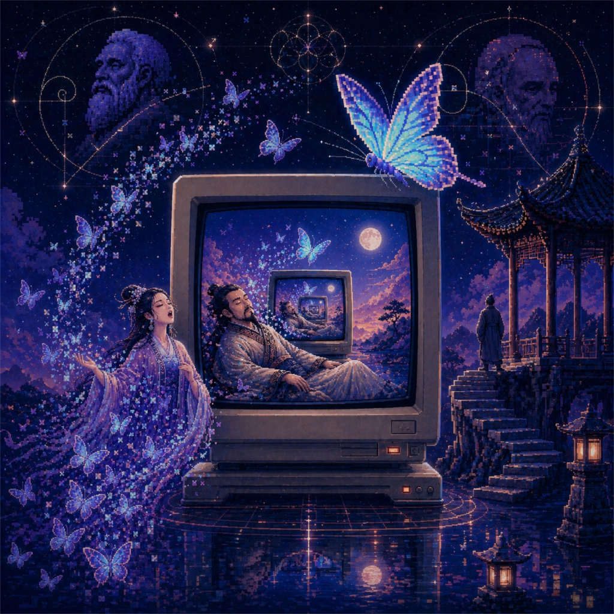

# 昔者庄周梦为胡蝶 · 独舞星辰 8-bit

  

## Lyrics

昔者庄周梦为胡蝶  
栩栩然胡蝶也  
自喻适志与  
不知周也  
不知周也  
俄然觉，则蘧蘧然周也  

不知周之梦为胡蝶与  
胡蝶之梦为周与  
周与胡蝶  
则必有分矣  
此之谓物化  
物化  
不知周也  
物化  

Die Wahrheiten sind Illusionen  
Illusionen  
Man muss noch Chaos in sich haben  
Chaos in sich haben  
Um einen tanzenden Stern  
Einen tanzenden Stern  
Gebären zu können  

L'existence précède l'essence  
Précède l'essence  
L'existence précède l'essence  

不知周之梦为胡蝶与  
胡蝶之梦为周与  
周与胡蝶  
则必有分矣  
此之谓物化  

我在  
我往  
不问其名  
不问其义  
不问其始  
不问其终  
无所待  
自适其志  

我在  
我往  
无所待  
自适其志  
我在  
我往  

此之谓物化  
物化  