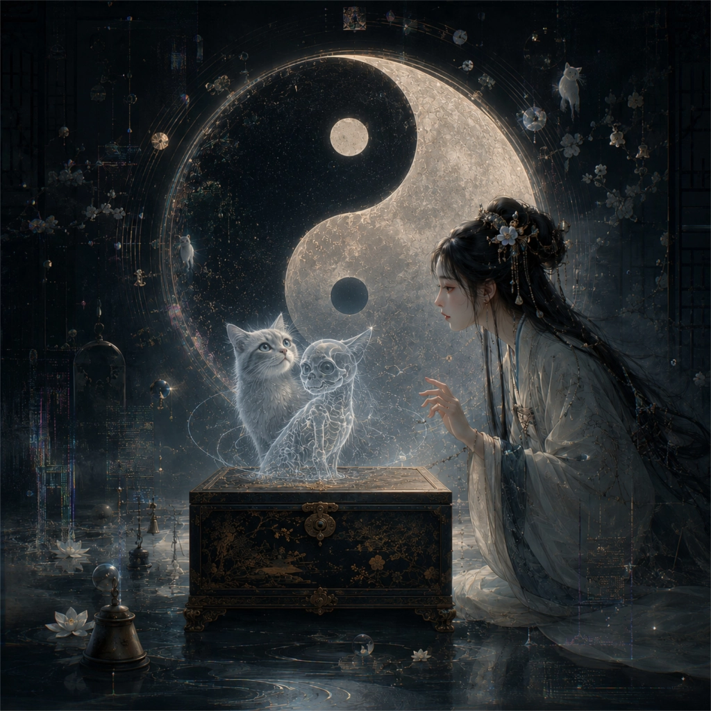

# 物无非彼 · 薛定谔猫匣 Lullaby

  

## Lyrics

Where are you  
Kitty kitty kitty  
Are you there  
Are you there  
Let me see  
Let me see  
Meow meow meow  
Meow meow meow  
Meow  
Meow  

物无非彼  
物无非是  
自彼则不见  
自知则知之  
故曰  
彼出于是  
是亦因彼  
彼是方生之说也  

Where's my cat  
Where's my cat  
Are you there  
Are you there  
Meow meow meow  
Meow meow meow  

虽然  
方生方死  
方死方生  
方可方不可  
方不可方可  
因是因非  
因非因是  

Where are you  
Kitty kitty kitty  
Meow meow meow  
Meow meow  

是以圣人不由  
而照之于天  
亦因是也  
是亦彼也  
彼亦是也  
彼亦一是非  
此亦一是非  
果且有彼是乎哉  
果且无彼是乎哉  

Let me see  
Let me see  
Is it alive  
Is it alive  
Are you there  
Are you there  
Meow meow meow  
Meow meow meow  

彼是莫得其偶  
谓之道枢  
枢始得其环中  
以应无穷  
是亦一无穷  
非亦一无穷也  
故曰  
莫若以明  
莫若以明  

方生方死  
方死方生  
方可方不可  
方不可方可  
Meow meow meow  
Meow meow meow  
方生方死  
方死方生  
莫若以明  
莫若以明  

薛子设密匣  
密匣纳幽猫  
微物若发动  
机括随之摇  
药落则猫死  
药悬则猫生  
匣门尚未启  
生死未定名  
既启见一相  
众人执其名  

Where's my cat  
Where's my cat  
Where are you  
Kitty kitty kitty  
Let me see  
Let me see  
Are you there  
Are you there  
Meow meow meow  
Meow meow meow  

方生方死  
方死方生  
方可方不可  
方不可方可  
匣门尚未启  
生死未定名  
Is it alive  
Is it alive  
Are you there  
Are you there  
Meow meow meow  
Meow meow meow  

匣门尚未启  
生死未定名  
一旦开启匣  
众人执其名  

匣门尚未启  
生死未定名  
一旦开启匣  
众人执其名  

方生方死  
方死方生  
方可方不可  
方不可方可  
Meow meow meow  
Meow meow meow  
匣门尚未启  
生死未定名  
一旦开启匣  
众人执其名  

Where's my cat  
Where's my cat  
Let me see  
Let me see  
Where are you  
Kitty kitty kitty  
Meow meow meow  
Meow meow meow  

是亦彼也  
彼亦是也  
方生方死  
方死方生  
故曰  
莫若以明  
莫若以明  

Where's my cat  
Where's my cat  
Are you there  
Are you there  
Meow meow meow  
Meow meow meow  
Meow meow  