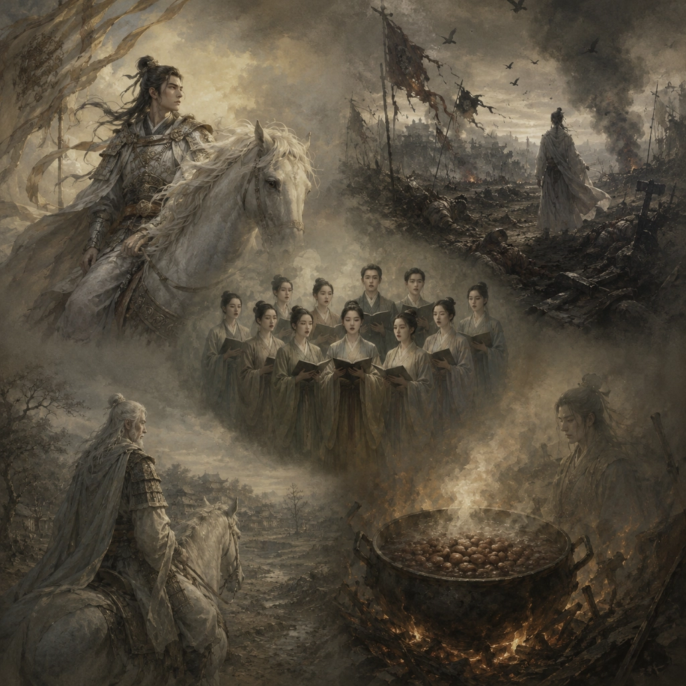

# 白马 战城南 · 十五燃豆萁 A Cappella

  

## Lyrics

白马饰金羁  
连翩西北驰  
借问谁家子  
幽并游侠儿  
少小去乡邑  
扬声沙漠垂  
宿昔秉良弓  
楛矢何参差  
控弦破左的  
右发摧月支  
仰手接飞猱  
俯身散马蹄  
狡捷过猴猿  
勇剽若豹螭  
边城多警急  
胡虏数迁移  

羽檄从北来  
厉马登高堤  
长驱蹈匈奴  
左顾陵鲜卑  

弃身锋刃端  
性命安可怀  
父母且不顾  
何言子与妻  
名编壮士籍  
不得中顾私  
捐躯赴国难  
视死忽如归  
视死忽如归  

战城南，死郭北  
野死不葬乌可食  
为我谓乌  
且为客豪  
野死谅不葬  
腐肉安能去子逃  
水深激激  
蒲苇冥冥  
枭骑战斗死  
驽马徘徊鸣  

梁筑室  
何以南  
何以北  
禾黍不获  
君何食  
愿为忠臣  
安可得  
思子良臣  
良臣诚可思  
朝行出攻  
暮不夜归  
不夜归  

十五从军征  
八十始得归  
道逢乡里人  
家中有阿谁  
遥看是君家  
松柏冢累累  
兔从狗窦入  
雉从梁上飞  
中庭生旅谷  
井上生旅葵  
舂谷持作饭  
采葵持作羹  
羹饭一时熟  
不知贻阿谁  
出门东向看  
泪落沾我衣  
泪落  

煮豆持作羹  
漉菽以为汁  
萁在釜下燃  
豆在釜中泣  
本是同根生  
相煎何太急  

白马饰金羁  
视死忽如归  
不知贻阿谁  
本是同根生  
相煎何太急  

相煎何太急  