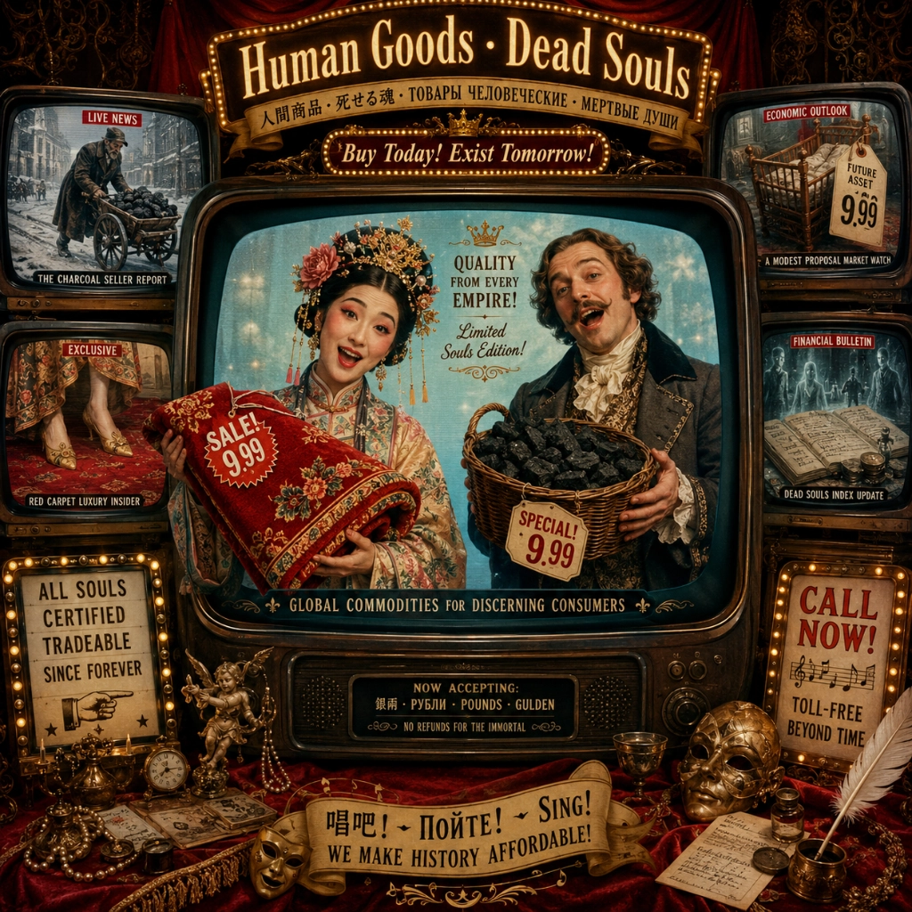

# 红线毯 卖炭翁 · Souls Infomercial

  

## Lyrics

人生不作人  
入账作货名  
衣可铺金殿  
炭可暖深庭  
子可标新价  
魂可入文契  
生死皆有用  
来听活物广告  

Human goods  
Human goods  
Soft value  
Warm value  
Tender value  
Dead value  
活物广告  
温柔上市  

红线毯  
择茧缫丝清水煮  
拣丝练线红蓝染  
染为红线红于蓝  
织作披香殿上毯  
披香殿广十丈余  
红线织成可殿铺  
彩丝茸茸香拂拂  
线软花虚不胜物  

Soft soft  
Premium soft  
Palace comfort  
Step by step  
一丈红线  
千两民丝  
高级柔软  
尊贵如期  
Touch the floor  
Feel the grace  
Every thread  
In its place  

美人踏上歌舞来  
罗袜绣鞋随步没  
太原毯涩毳缕硬  
蜀都褥薄锦花冷  
不如此毯温且柔  
年年十月来宣州  
宣城太守加样织  
自谓为臣能竭力  
百夫同担进宫中  
线厚丝多卷不得  
宣城太守知不知  
一丈毯，千两丝  
地不知寒人要暖  
少夺人衣作地衣  

少夺一点点  
柔软多一点  
少寒一点点  
体面多一点  
Premium carpet  
Premium feet  
Human warmth underneath  

地暖非春暖  
堂深不见寒  
衣锦犹嫌薄  
更问南山炭  

卖炭翁  
伐薪烧炭南山中  
满面尘灰烟火色  
两鬓苍苍十指黑  
卖炭得钱何所营  
身上衣裳口中食  
可怜身上衣正单  
心忧炭贱愿天寒  

南山好炭  
深庭严选  
烟火成色  
老手烧炼  
千斤好货  
轻松到店  
文书齐备  
当场结清  
No delay  
No complaint  
Half-price warmth  
Full-size gain  

夜来城外一尺雪  
晓驾炭车辗冰辙  
牛困人饥日已高  
市南门外泥中歇  
翩翩两骑来是谁  
黄衣使者白衫儿  
手把文书口称敕  
回车叱牛牵向北  
一车炭重千余斤  
宫使驱将惜不得  
半匹红纱一丈绫  
系向牛头充炭直  

半匹红纱  
一丈绫  
千斤好炭  
马上清  
半匹红纱  
一丈绫  
亏不亏  
问牛听  
One cart  
One deal  
One seal  
So real  
Half a silk  
One bright thread  
Warm the hall  
Leave him fed  

你的炭  
有价值  
你的寒  
有价值  
你的车  
有价值  
你的饿  
有价值  
Every hunger  
Has a price  
Every winter  
Advertised  

炭尽人犹在  
人贫子亦贫  
若问生何用  
标价作新珍  

A modest proposal  
A modest price  
A modest plan  
For a modest life  

For preventing the children  
Of poor people  
From being a burden  
On their parents  
Or country  
And for making them  
Beneficial  
To the publick  

Fair, cheap, easy method  
Sound, useful  
Members of the commonwealth  

A young healthy child  
Well nursed  
At a year old  

Most delicious, nourishing, wholesome  
Stewed, roasted, baked or boiled  

Only 9.99, only 9.99  
Tender value, family size  
Only 9.99, only 9.99  
Public good, private dine  
Buy the plan, cut the loss  
Feed the table, count the cost  

Human value optimized  
Family burden monetized  
Tender future advertised  
Only 9.99, only 9.99  

生时充口腹  
名曰有余益  
价轻如笑语  
账冷胜刀笔  
若问人何在  
人在人言里  
若问魂何用  
魂在文契里  

Мёртвые души  
Dead souls  
死魂灵  
Мёртвые души  
Dead souls  
账中可行  

Да как же уступить их  
Да так просто  
Или, пожалуй, продайте  
Я вам за них дам деньги  
Да на что ж они тебе  
Это уж мое дело  
Да ведь они ж мертвые  
Мертвые души  

Dead Souls Mortgage Service  
Low risk, high yield  
Dead on paper, alive in credit  
Gone from earth, still in file  

你的衣  
有价值  
你的炭  
有价值  
你的子  
有价值  
你的死  
也有价值  

衣去作地衣  
炭去暖深庭  
子去成小价  
魂去入空名  
人间无废物  
账上有余生  
莫问谁为货  
歌声已结清  

你的衣  
有价值  
你的炭  
有价值  
你的子  
有价值  
你的死  
也有价值  

Human goods  
Human goods  
Soft value  
Warm value  